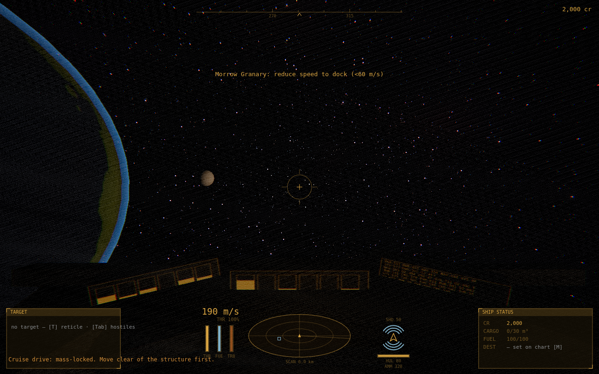

# VOID FREIGHTER

A gritty multiplayer space-hauling sim in the browser: haul freight, chase
arbitrage, crack asteroids and survive pirate ambushes in the cold of the
Vesper system. *Euro Truck Simulator in space + Elite Dangerous lite + a
living EVE-style economy.*

**Everything is procedural** — ships, planets, stations, asteroids, UI icons,
post-processing and every sound are generated from code at runtime. The repo
contains zero binary assets.



## How it plays

- **Haul** — take transport contracts from station boards, beat the deadline.
- **Trade** — buy cheap at producers, sell dear at consumers. Prices move with
  supply/demand, your own orders included, and revert over time.
- **Mine** — crack rocks in four asteroid belts, scoop fragments, refine ore.
- **Fight** — pirates patrol red zones and interdict rich cargo. Loot pays.
- **Upgrade** — 5 hulls and 12 module families across 5 tiers.
- Death loses your cargo and an insurance deductible. Fuel is finite. The void
  does not care about you.

One shared star system, one shared economy: every player's trades move the
same prices. Stations are safe ground; deep space is not.

The void is worked, not empty: bulk carriers and couriers ride the trade
lanes (and actually deliver the stock they carry), faction patrols hunt
pirates, wandering merchants sell what customs wouldn't approve ([U] to
hail), and sometimes a MAYDAY crackles in from a civilian who won't last
another minute without you.

## Quick start (offline)

```bash
npm install
npm run dev          # http://localhost:5173 — press LAUNCH
```

Offline play runs the full simulation in your browser and saves to
localStorage. `F1` shows the flight manual. Start docked, check the market
(K), grab a contract, undock (Space), set a destination on the chart (M) and
hold Shift to cruise.

## Multiplayer server

```bash
npm run build        # client -> dist/
npm run server       # http://localhost:8788 (in-memory DB without Postgres)
```

With Docker (persistent Postgres):

```bash
cp .env.example .env # set POSTGRES_PASSWORD
docker compose up -d --build
# open http://localhost:8788
```

For internet hosting put a TLS reverse proxy in front (the WebSocket lives at
`/ws`; the client auto-selects `wss://` on https pages). Caddy example:

```
game.example.com {
    reverse_proxy 127.0.0.1:8788
}
```

Notes:
- Accounts: scrypt password hashes, 7-day bearer tokens, per-IP rate limiting.
- The game container publishes on loopback only; the proxy is the public door.
- `ALLOW_DEV_COMMANDS=1` enables teleport/credits cheats for test bots —
  never set it in production.
- Player state is JSONB in Postgres, autosaved every 30 s, on logout and on
  shutdown. Market state persists too.

## Controls

| Key | Action |
|---|---|
| Shift / W | throttle up (gradual) |
| Ctrl / S | throttle down — hold past zero to brake |
| Caps Lock | cruise drive ("hypervelocity") · X cut throttle |
| A D R F | strafe · Q E roll · mouse pitch/yaw · Z flight assist |
| LMB / RMB | cannon / missile (when locked) |
| Tab / T | cycle hostiles / target reticle |
| G | mining drill · Space dock/undock · H rescue tow |
| M B C J K L | map · cargo · ship · journal · market · contacts |
| N / V / Enter / F1 | set destination · camera · chat · help |

## Development

```bash
npm test             # 51 vitest specs: physics, economy, combat, mining,
                     # contracts, auth/WS/persistence/anti-dupe
npm run typecheck
npm run smoke        # trade / mine / combat bot runs against the real sim
npm run tour         # headless-browser screenshot tour (needs Chromium)
npm run tour:online  # 2 real browser clients vs the real server
```

Architecture (mirrors the `world-of-claudecraft` stack):

```
src/sim/      deterministic core — flight, economy, combat, mining, AI, loot.
              No DOM. Same code runs offline (browser) and in the server.
src/render/   three.js, all procedural: bodies, ships, asteroids, fx, post
src/game/     input, cameras, WebAudio synth, orchestrator
src/ui/       canvas HUD + radar, system chart, station windows, chat, menu
src/net/      protocol + ClientWorld (prediction/reconciliation mirror)
src/world_api.ts  IWorld — render/UI never know if they're offline or online
server/       HTTP auth + WS world + Postgres JSONB (in-memory fallback)
tests/        vitest; scripts/ smoke bots + browser tours
docs/design/  balance numbers & design decisions
```

World seed is fixed (`WORLD_SEED` in `src/sim/system.ts`): the Vesper system
is the same place for every client, so only dynamic state crosses the wire —
asteroid fields sync as damage deltas over deterministic local generation.

## License

MIT — see [DESIGN.md](DESIGN.md) for the original design document.
